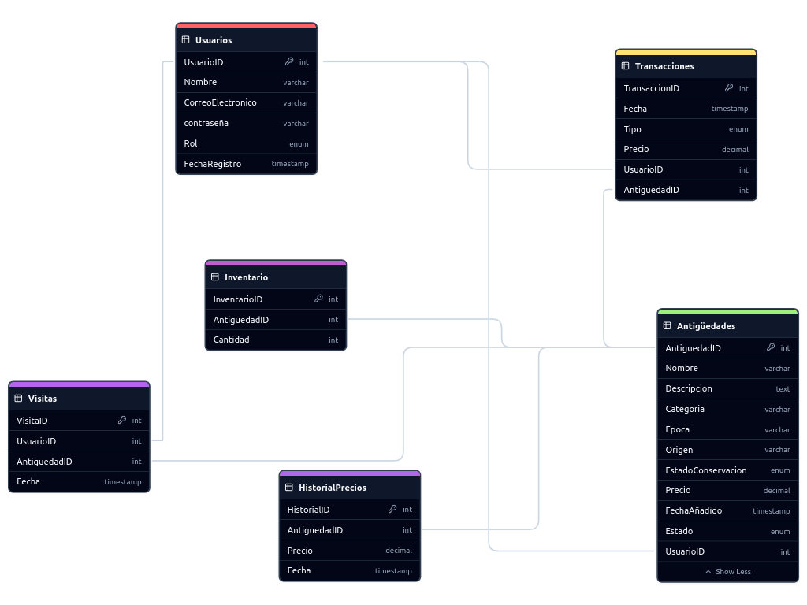

# Base de Datos del Negocio de Antigüedades

## Diagrama de Entidad-Relación



# Consultas para la Base de Datos del Negocio de Antigüedades

## 1. Listar Todas las Antigüedades Disponibles para la Venta

**Enunciado:** Obtén una lista de todas las piezas antiguas que están actualmente disponibles para la venta, incluyendo el nombre de la pieza, su categoría, precio y estado de conservación.

```sql
SELECT Nombre, Categoria, Precio, EstadoConservacion
FROM Antigüedades
WHERE Estado = 'en venta';

+----------------------+-----------+---------+--------------------+
| Nombre               | Categoria | Precio  | EstadoConservacion |
+----------------------+-----------+---------+--------------------+
| Vase Chino Ming      | Cerámica  | 1500.00 | excelente          |
| Silla Victoriana     | Muebles   |  800.00 | bueno              |
| Cuadro Impresionista | Arte      | 2500.00 | excelente          |
| Reloj de Bolsillo    | Relojes   |  400.00 | regular            |
| Vase Chino Ming      | Cerámica  | 1500.00 | excelente          |
| Silla Victoriana     | Muebles   |  800.00 | bueno              |
| Cuadro Impresionista | Arte      | 2500.00 | excelente          |
| Reloj de Bolsillo    | Relojes   |  400.00 | regular            |
+----------------------+-----------+---------+--------------------+
8 rows in set (0,05 sec)

```

## 2. Buscar Antigüedades por Categoría y Rango de Precio

**Enunciado:** Busca todas las antigüedades dentro de una categoría específica (por ejemplo, 'Muebles') que tengan un precio dentro de un rango determinado (por ejemplo, entre 500 y 2000 dólares).

```sql
SELECT Nombre, Precio, Categoria
FROM Antigüedades
WHERE Categoria = 'Muebles' AND Precio BETWEEN 500 AND 2000 AND Estado = 'en venta';

+------------------+--------+-----------+
| Nombre           | Precio | Categoria |
+------------------+--------+-----------+
| Silla Victoriana | 800.00 | Muebles   |
| Silla Victoriana | 800.00 | Muebles   |
+------------------+--------+-----------+
2 rows in set (0,00 sec)

```

## 3. Mostrar el Historial de Ventas de un Cliente Específico

**Enunciado:** Muestra todas las piezas antiguas que un cliente específico ha vendido, incluyendo la fecha de la venta, el precio de venta y el comprador.

```sql
SELECT A.Nombre AS Antiguedad, T.Precio, T.Fecha AS FechaVenta, C.Nombre AS Comprador
FROM Transacciones T
JOIN Antigüedades A ON T.AntiguedadID = A.AntiguedadID
JOIN Usuarios V ON T.UsuarioID = V.UsuarioID
JOIN Usuarios C ON C.UsuarioID = (SELECT UsuarioID FROM Transacciones WHERE TransaccionID = T.TransaccionID) 
WHERE T.Tipo = 'venta' AND V.UsuarioID = 1;  

+-------------------+--------+---------------------+------------------+
| Antiguedad        | Precio | FechaVenta          | Comprador        |
+-------------------+--------+---------------------+------------------+
| Silla Victoriana  | 800.00 | 2024-09-15 09:45:00 | Carlos Martínez  |
| Reloj de Bolsillo | 400.00 | 2024-09-17 15:30:00 | Carlos Martínez  |
| Silla Victoriana  | 800.00 | 2024-09-15 09:45:00 | Carlos Martínez  |
| Reloj de Bolsillo | 400.00 | 2024-09-17 15:30:00 | Carlos Martínez  |
+-------------------+--------+---------------------+------------------+
4 rows in set (0,00 sec)

```

## 4. Obtener el Total de Ventas Realizadas en un Período de Tiempo

**Enunciado:** Calcula el total de ventas realizadas en un período específico, por ejemplo, durante el último mes.

```sql
SELECT SUM(Precio) AS TotalVentas
FROM Transacciones
WHERE Tipo = 'venta' AND Fecha BETWEEN DATE_SUB(NOW(), INTERVAL 1 MONTH) AND NOW();

+-------------+
| TotalVentas |
+-------------+
|     2400.00 |
+-------------+
1 row in set (0,01 sec)

```

## 5. Encontrar los Clientes Más Activos (Con Más Compras Realizadas)

**Enunciado:** Identifica los clientes que han realizado la mayor cantidad de compras en la plataforma.

```sql
SELECT U.Nombre, COUNT(T.TransaccionID) AS NumeroDeCompras
FROM Transacciones T
JOIN Usuarios U ON T.UsuarioID = U.UsuarioID
WHERE T.Tipo = 'compra'
GROUP BY U.UsuarioID
ORDER BY NumeroDeCompras DESC;

+------------+-----------------+
| Nombre     | NumeroDeCompras |
+------------+-----------------+
| Ana Gómez  |               4 |
+------------+-----------------+
1 row in set (0,05 sec)

```

## 6. Listar las Antigüedades Más Populares por Número de Visitas o Consultas

**Enunciado:** Muestra las piezas antiguas que han recibido la mayor cantidad de visitas o consultas por parte de los usuarios.

```sql
SELECT A.Nombre, COUNT(V.VisitaID) AS NumeroDeVisitas
FROM Visitas V
JOIN Antigüedades A ON V.AntiguedadID = A.AntiguedadID
GROUP BY A.AntiguedadID
ORDER BY NumeroDeVisitas DESC;

+----------------------+-----------------+
| Nombre               | NumeroDeVisitas |
+----------------------+-----------------+
| Vase Chino Ming      |               2 |
| Silla Victoriana     |               2 |
| Cuadro Impresionista |               2 |
| Reloj de Bolsillo    |               2 |
+----------------------+-----------------+
4 rows in set (0,00 sec)

```

## 7. Listar las Antigüedades Vendidas en un Rango de Fechas Específico

**Enunciado:** Obtén una lista de todas las piezas antiguas que se han vendido dentro de un rango de fechas específico, incluyendo la información del vendedor y comprador.

```sql
SELECT A.Nombre AS Antiguedad, T.Precio, T.Fecha AS FechaVenta, V.Nombre AS Vendedor, C.Nombre AS Comprador
FROM Transacciones T
JOIN Antigüedades A ON T.AntiguedadID = A.AntiguedadID
JOIN Usuarios V ON A.UsuarioID = V.UsuarioID  
JOIN Usuarios C ON T.UsuarioID = C.UsuarioID 
WHERE T.Tipo = 'venta' AND T.Fecha BETWEEN '2024-09-10' AND '2024-09-17';


+------------------+--------+---------------------+------------------+------------------+
| Antiguedad       | Precio | FechaVenta          | Vendedor         | Comprador        |
+------------------+--------+---------------------+------------------+------------------+
| Silla Victoriana | 800.00 | 2024-09-15 09:45:00 | Carlos Martínez  | Carlos Martínez  |
| Silla Victoriana | 800.00 | 2024-09-15 09:45:00 | Carlos Martínez  | Carlos Martínez  |
+------------------+--------+---------------------+------------------+------------------+
2 rows in set (0,00 sec)


```

## 8. Obtener un Informe de Inventario Actual

**Enunciado:** Genera un informe del inventario actual de antigüedades disponibles para la venta, mostrando la cantidad de artículos por categoría.

```sql
SELECT A.Categoria, COUNT(I.InventarioID) AS CantidadArticulos
FROM Inventario I
JOIN Antigüedades A ON I.AntiguedadID = A.AntiguedadID
WHERE A.Estado = 'en venta'
GROUP BY A.Categoria;

+-----------+-------------------+
| Categoria | CantidadArticulos |
+-----------+-------------------+
| Cerámica  |                 2 |
| Muebles   |                 2 |
| Arte      |                 2 |
| Relojes   |                 2 |
+-----------+-------------------+
4 rows in set (0,00 sec)

```


